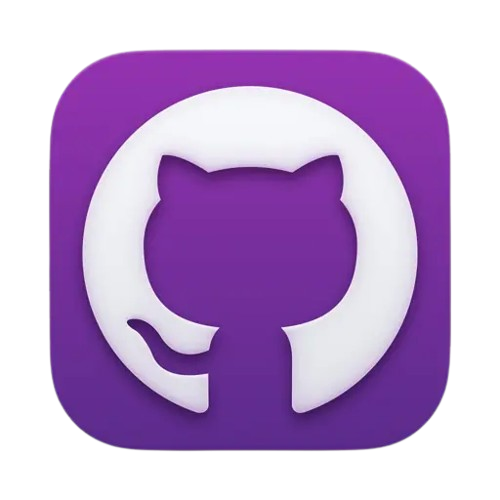
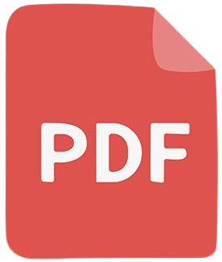
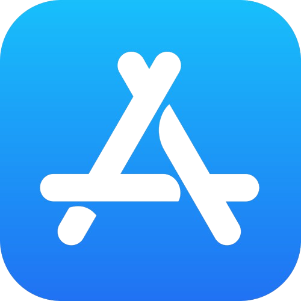

# 👋 안녕하세요, 도전하며 성장하는 개발자 주천수입니다.

- 백엔드 개발을 중심으로 다양한 웹·앱 서비스를 개발하며, AI 기술을 실제 서비스에 적용하는 경험을 쌓고 있습니다.

<!--
## 📁 포트폴리오

> 전체 프로젝트 중 주요 프로젝트를 선별한 포트폴리오입니다.

[PDF]

<b>📖 포트폴리오 미리보기</b>

-->

## 💻 프로젝트

|           기간          |    프로젝트   |              설명              |                                                      GitHub                                                     |                                                                                                                                                                                                  링크 / 자료                                                                                                                                                                                                 |
| :-------------------: | :-------: | :--------------------------: | :-------------------------------------------------------------------------------------------------------------: | :------------------------------------------------------------------------------------------------------------------------------------------------------------------------------------------------------------------------------------------------------------------------------------------------------------------------------------------------------------------------------------------------------: |
|   2025.08.03~**운영**   | DASOM Web |           동아리 홈페이지           |        |                                                                                                                                                                                                                                                                                                          |
| 2025.08.03~2026.02.20 |  SpeakOn  |       AI 비즈니스 영어 회화 서비스      |         |                                                                                                                                                                                                                                                                                                     |
|   2026.02.17~**운영**   |   WAVEY   |         한국 AI 가이드 서비스        |  |                                                                                                                                                                                                                                                                          |
|   2026.03.01~**운영**   |   PICKE   | 지식을 듣고 생각을 Pick하는 참여형 지식 플랫폼 |           |      |
| 2026.03.22~2026.08.16 |     찍먹    |    20대를 위한 맞춤 문화활동 추천 서비스    |          |                                                                                                                                                                                                                                                    |
| 2026.08.03~2026.10.16 | WORKSAFE+ |   건설 현장 IoT 드론 안전 모니터링 시스템   |     |                                                                                                                                                                                                                                                                                         |

## 👥 동아리

|           기간          |        동아리       |  역할  |      프로젝트     |
| :-------------------: | :--------------: | :--: | :-----------: |
| 2025.03.15~2027.02.28 |     **DASOM**    | 학술부장 | **DASOM Web** |
| 2025.08.18~2026.02.20 |    **UMC 9기**    |  백엔드 |  **SpeakOn**  |
| 2026.02.13~2026.08.31 | **IT's TIME 9기** |  백엔드 |     **찍먹**    |
| 2026.02.17~2026.04.25 |   **SWYP 앱 4기**  |  백엔드 |   **PICKE**   |

## 🏆 수상

|     일자     |    수상   |    대회    |          기관          |
| :--------: | :-----: | :------: | :------------------: |
| 2025.06.02 | **장려상** |    솜커톤   |    동양미래대학교 컴퓨터공학부    |
| 2026.04.25 |  **대상** |   SWYP 앱 4기   |        (주)스위그        |
| 2026.10.16 | **장려상** | 동양미래EXPO | 동양미래대학교 / KES(한국전자전) |

## 📜 자격증

|     취득일    |        자격증       |    발급기관    |
| :--------: | :--------------: | :--------: |
| 2024.06.21 |     **SQLD**     | 한국데이터산업진흥원 |
| 2026.03.11 | **정보처리산업기사(필기)** |  한국산업인력공단  |

## 🎓 교육

|           기간          |          기관         |            설명           |
| :-------------------: | :-----------------: | :---------------------: |
| 2024.09.22~2025.02.12 | **(주)코리아아이티아카데미인천** | 웹개발, Cisco, Linux, Java |
|  2026.09.21~2026.10.7 |   **(사)스마트제조혁신협회**  |     제조AI 솔루션 인턴십 과정     |

## 🌐 대외활동

<table>
  <thead>
    <tr>
      <th align="center">일시/기간</th>
      <th align="center">활동</th>
      <th align="center">기관</th>
    </tr>
  </thead>
  <tbody>
    <tr>
      <td align="center">2025.04.05 13:00~18:00</td>
      <td align="center"><b>Build with AI : Hello-World</b></td>
      <td align="center" rowspan="2">Google for Developers (GDG)</td>
    </tr>
    <tr>
      <td align="center">2025.05.24 13:00~18:30</td>
      <td align="center"><b>Kprintf 2025</b></td>
    </tr>
    <tr>
      <td align="center">2026.03.16~2026.05.13</td>
      <td align="center"><b>서울시 빅데이터 활용 경진대회 창업부문</b></td>
      <td align="center">서울특별시</td>
    </tr>
    <tr>
      <td align="center">2026.03.30~2026.09.21</td>
      <td align="center"><b>2026 관광데이터 활용 공모전 웹/앱 개발 부문</b></td>
      <td align="center">한국관광공사 X 카카오</td>
    </tr>
    <tr>
      <td align="center">2026.04.09~2026.05.28</td>
      <td align="center"><b>AI 활용 태일씨앤티 홈페이지 리뉴얼 경진대회</b></td>
      <td align="center">(주)태일씨앤티</td>
    </tr>
    <tr>
      <td align="center">2026.04.27~2026.06.26</td>
      <td align="center"><b>제4회 문화체육관광 인공지능·데이터 활용 공모전</b></td>
      <td align="center">문화체육관광부</td>
    </tr>
    <tr>
      <td align="center">2026.05.14~2026.09.04</td>
      <td align="center"><b>모두의 창업 1기</b></td>
      <td align="center" rowspan="2">중소벤처기업부</td>
    </tr>
    <tr>
      <td align="center">2026.09.15~진행중</td>
      <td align="center"><b>모두의 창업 2기</b></td>
    </tr>
  </tbody>
</table>

## 🏢 국가근로

|             근로기관             |                                                                                                                          기간 및 주요 업무                                                                                                                          |
| :--------------------------: | :----------------------------------------------------------------------------------------------------------------------------------------------------------------------------------------------------------------------------------------------------------: |
| **서울특별시교육청교육연수원 초등교원연수부** | **2025.07.01 ~ 08.29** 초등 1급 정교사 자격연수 · 유/초등 교육전문직원 임용후보자 직무연수 · 초등 특수/교감 자격연수 운영  **2026.01.02 ~ 01.30** 유치원 1급 정교사 자격연수 · 유/초등 복직교사 역량강화 직무연수 운영  **2026.07.01 ~ 08.21** 초등(특수) 교감 자격연수 · 유/초등 교육전문직원 임용후보자 직무연수 · 유치원 1급 정교사 자격연수 운영 |

<!--
상세 업무
· 민원 응대 및 안내
· 강의실 및 간식 세팅/정리
· 평가실 인솔 및 평가 감독
· 온/오프라인 근태 관리
-->
